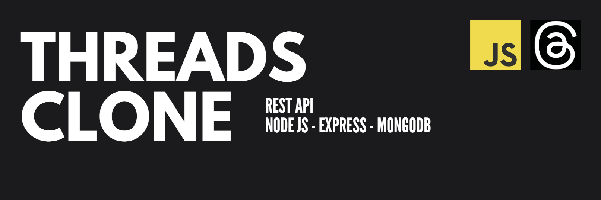

# Threads Clone REST API With [Node](https://nodejs.org/), [Express](https://expressjs.com/), [MongoDB](https://www.mongodb.com/), [`DEMO`](https://threads-app-jg3g.onrender.com)



Features :

* JsonWebToken  based Authentication
* User Profile
* Comment to a Post
* Like/Unlike Post
* Follow/Unfollow Users

### Description

A REST API I watched from a [YouTube](https://youtu.be/tvKhOAlAjTY?si=Go7KOjeKUx6sXGhf) video and learned new things through it

### Install packages
```
npm i
```
### Setup .env file
``` bash
MONGODB_URL = 
PORT = 
JWT_SECRET =
```

### Start the app
```
npm run dev
```

<i>Ashkan<i>
